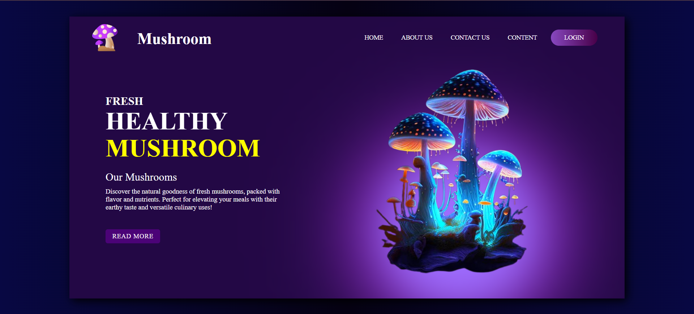

# Mushroom Home Page

## Introduction

This repository contains the code for a **Mushroom Home Page** designed using **HTML** and **CSS**. The page showcases a clean and modern layout, highlighting the natural goodness of fresh mushrooms. Key features include:

- A visually appealing design with a focus on fresh and healthy mushrooms.
- Sections for **Home**, **About Us**, and **Contact Us** to provide essential information.
- A captivating description of the benefits and culinary uses of mushrooms.
- A **"Read More"** button to encourage user engagement.

This project demonstrates my skills in frontend development, particularly in creating responsive and user-friendly web pages using HTML and CSS.

